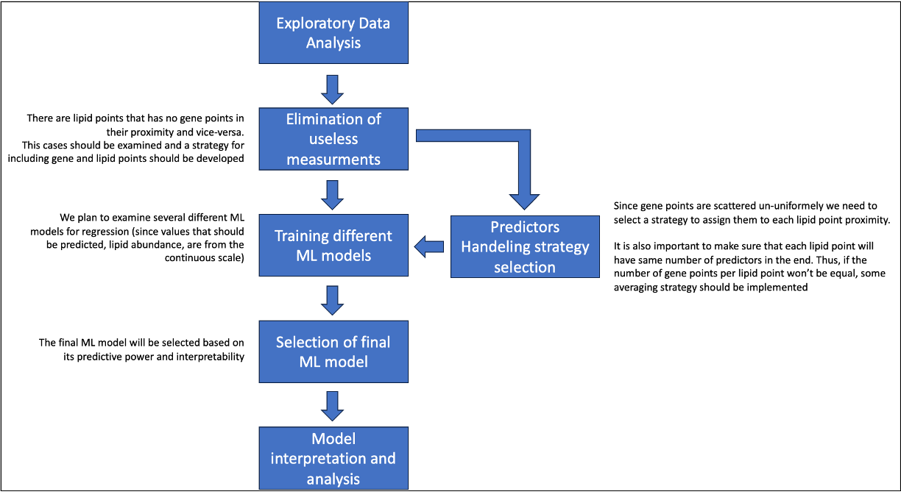
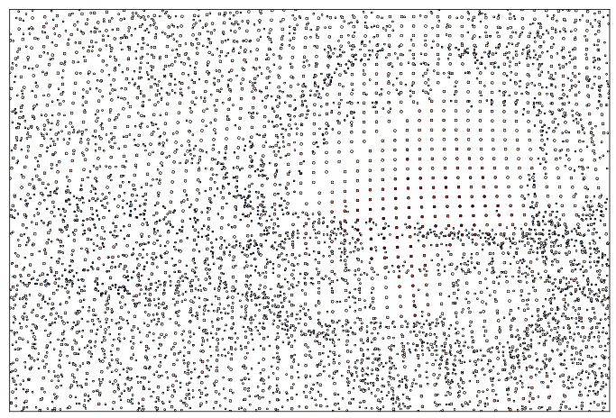

# Predicting lipid distribution in a brain section from spatial gene expression

## Project description

### Brief description of the project (given by the professor)
This project focuses on predicting lipid distribution in a specific brain section using spatial gene expression data.

### Brief description of the project (understood by the performing team)
Predict the abundance of the given lipid (202 lipids in total) on the brain section using the expression levels of 500 genes, measured in the proximity. The task thus boils down to regression since the values that have to be predicted are coming from the continous scale. \
The main difficulty is that the spots where gene expression was measured are scattered non-uniformely across the brain section and thus points where we want to predict lipid abundance might have different number of gene expression spots in the proximity. 

### Dataset composition:
#### Genes' expression 
The dataset for gene expression comprises 3,741,416 rows and 596 columns. 
After isolating only Section 12, there are 186,090 remaining rows.
Each row corresponds to a specific point on mouse brain Section 12, where the expression levels of **500 genes** were measured.
The columns **x_ccf**, **y_ccf**, and **z_ccf** denote the spatial coordinates of these points, sharing the same scale as the coordinates in the lipids' data. 
Gene expression values are found in columns 46 to 545, while all other data in the gene expression dataset is irrelevant to this project.
The distribution of gene expression measurement points across the brain section is non-uniform, as illustrated in [Figure 1](#points-image).

#### Lipids' abundance
The lipid dataset consists of 2,229,568 rows and 208 columns.
After isolating only Section 12, the remaining rows amount to 94,747.
Each row corresponds to a point on mouse brain Section 12, where the abundance of **202 lipids** was measured.
The columns **x_ccf**, **y_ccf**, and **z_ccf** depict the spatial coordinates of the dot.
Since we focus exclusively on Section 12, the x_ccf coordinate remains consistent for all measurements and is not relevant to this project. 
Lipid abundances are presented in columns 4 to 205, with each lipid having a dedicated column.
The last three columns represent the aligned representation of each measured dot but are not pertinent to this project. 
The measurement points for lipids are uniformly distributed across the brain section, as illustrated in [Figure 1](#points-image).

### Main Steps of the Project
1. [List your main steps here.]

## Usage

### Libraries:
- pandas (version)
- numpy (version)
- matplotlib (version)
- seaborn (version)
- scipy (version)
- pycaret[full]
- tables

## Images

*Figure 1. Points where lipid abundances (larger) and gene expression (smaller) were measured are depicted in this image. The y_ccf and z_ccf coordinates were utilized to generate this representation, while the x_ccf coordinate was disregarded. The size of the points corresponds to the measurement values, with larger points indicating lipid abundances and smaller points indicating gene expression levels.

