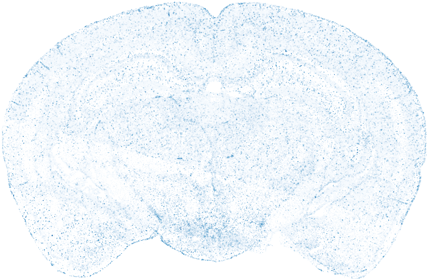
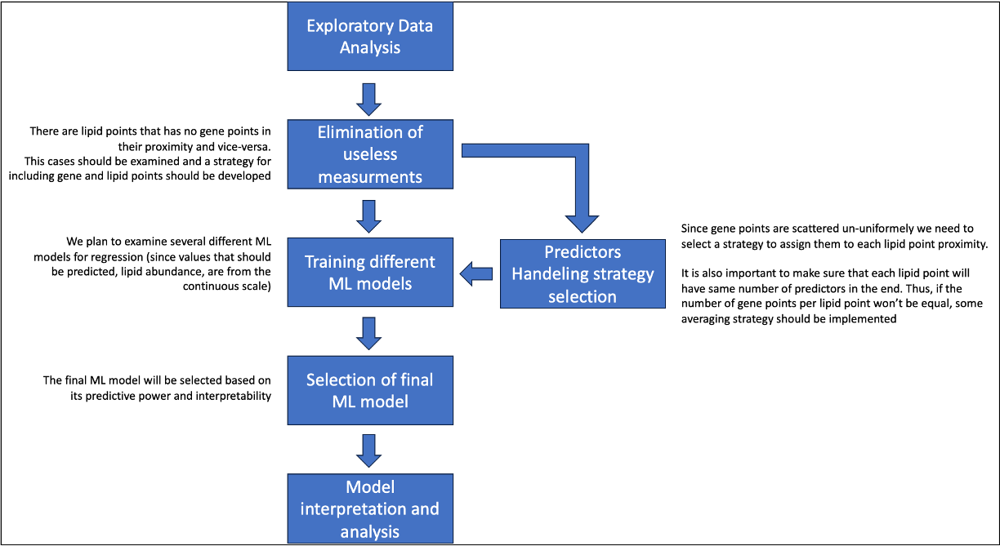

# Predicting lipid distribution in a brain section from spatial gene expression

## Project description
This project aims to predict the abundance of 202 lipids on a specific brain section using spatial gene expression data. 
The prediction is based on the expression levels of 500 genes.

### Task Overview
The task is essentially a regression problem, as it involves predicting values on a continuous scale. 
Specifically, we are predicting the abundance of a given lipid using the expression levels of nearby genes.

### Challenge
The main challenge lies in the non-uniform distribution of spots where gene expression was measured across the brain section. 
Consequently, the points where we want to predict lipid abundance may vary in the number of gene expression spots in proximity. 
Managing this variability is a key aspect of addressing the task effectively.

### Dataset composition:
#### Genes' expression 
The dataset for gene expression comprises 3,741,416 rows and 596 columns. 
After isolating only Section 12, there are 186,090 remaining rows.
Each row corresponds to a specific point on mouse brain Section 12, where the expression levels of **500 genes** were measured.
The columns **x_ccf**, **y_ccf**, and **z_ccf** denote the spatial coordinates of these points, sharing the same scale as the coordinates in the lipids' data. 
Gene expression values are found in columns 46 to 545, while all other data in the gene expression dataset is irrelevant to this project.
The distribution of gene expression measurement points across the brain section is non-uniform, as illustrated in [Figure 1](#points-image).

#### Lipids' abundance
The lipid dataset consists of 2,229,568 rows and 208 columns.
After isolating only Section 12, the remaining rows amount to 94,747.
Each row corresponds to a point on mouse brain Section 12, where the abundance of **202 lipids** was measured.
The columns **x_ccf**, **y_ccf**, and **z_ccf** depict the spatial coordinates of the dot.
Since we focus exclusively on Section 12, the x_ccf coordinate remains consistent for all measurements and is not relevant to this project. 
Lipid abundances are presented in columns 4 to 205, with each lipid having a dedicated column.
The last three columns represent the aligned representation of each measured dot but are not pertinent to this project. 
The measurement points for lipids are uniformly distributed across the brain section, as illustrated in [Figure 1](#points-image).

### Main Steps of the Project
1. Exploratory data analysis
2. Data cleaning
3. Predictors destribution
4. ML models training
5. Selection of final ML model
6. Model interpretation &  analysis

## Usage

### Libraries:
- pandas (version)
- numpy (version)
- matplotlib (version)
- seaborn (version)
- scipy (version)
- pycaret[full]
- tables

## Images
### Points Measurement Image

*Figure 1. Points where lipid abundances (larger) and gene expression (smaller) were measured are depicted in this image. The y_ccf and z_ccf coordinates were utilized to generate this representation, while the x_ccf coordinate was disregarded. The size of the points corresponds to the measurement values, with larger points indicating lipid abundances and smaller points indicating gene expression levels.*

