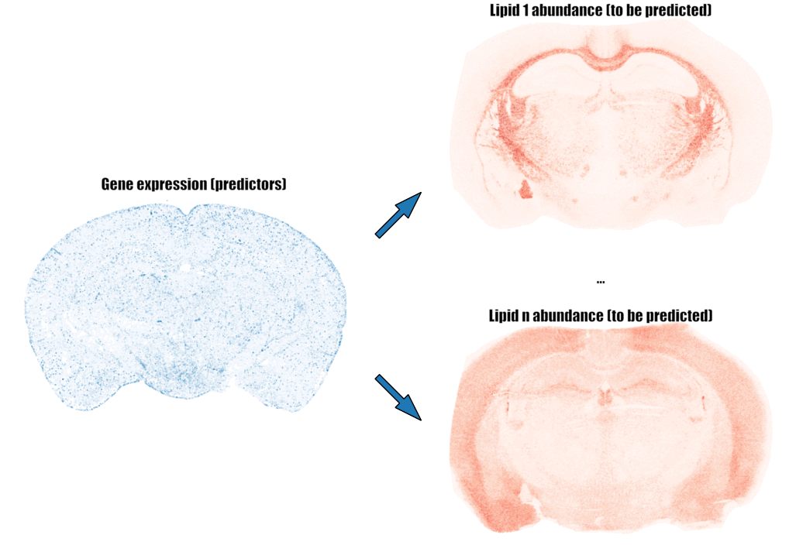

# Predicting lipid abundance in a murine brain section from spatial gene expression

<a id="gif-image"></a>

## ML4Science

**Group**: Lusine Khachatryan, Jules Perrin, Viola Renne  
**Tutors**: Luca Fusar Bassini, Halima Hannah Schede  
**Supervisor**: Gioele La Manno  
**Laboratory**: Laboratory of Brain Development and Biological Data Science, EPFL, Switzerland  
**ML Project**: ML4Science  

## Project description
This project aims to predict the abundance of 156 lipids in a specific brain section using spatial gene expression data. 
The prediction is based on the expression levels of 500 genes.

### Task Overview
The task is essentially a regression problem, as it involves predicting values on a continuous scale. 
Specifically, we are predicting the abundance of a given lipid using the expression levels of nearby genes.

### Challenge
The main challenge lies in the non-uniform distribution of spots where gene expression was measured across the brain section (see Figure 1). 
Consequently, the points where we want to predict lipid abundance may vary in the number of gene expression spots in proximity. 
Managing this variability is a key aspect of addressing the task effectively.

### Dataset composition:
#### Genes' expression 
The dataset for gene expression comprises 3,741,416 rows and 596 columns. 
After isolating only Section 12, there are 186,090 remaining rows.
Each row corresponds to a specific point (nucleus) in mouse (_Mus musculus_) brain Section 12, where the expression levels of **500 genes** were measured.
The columns **x_ccf**, **y_ccf**, and **z_ccf** denote the spatial coordinates of these nuclei, sharing the same scale as the coordinates in the lipids' data. 
Gene expression values are found in columns 46 to 545, while all other data in the gene expression dataset is irrelevant to this project.
The distribution of gene expression measurement points across the brain section is non-uniform, as illustrated in [Figure 1](#points-image).

#### Lipids' abundance
In this study our objective is to accurately predict the abundance of 156 brain lipids, each measured in 89,395 points across the _Mus musculus_ brain.
Since we focus exclusively on Section 12, the x_ccf coordinate remains consistent for all measurements and is not relevant to this project. 
Each lipid has a dedicated column. The measurement points for lipids are uniformly distributed across the brain section, as illustrated in [Figure 1](#points-image).

### Main Steps of the Project
1. Exploratory data analysis
2. Data cleaning
3. Predictors distribution
4. ML models training
5. Selection of final ML model
6. Model interpretation & and analysis

## Usage

### Environment
You can use the environment.yml file to create a conda environment with all the necessary libraries. (CPU Version) We recommend using Miniconda to create the environment.

```bash
conda env create -f environment-cpu.yml
```
The CPU version is a fallback option if you don't have an NVIDIA GPU, since the 
computational time is significantly longer.
But if you have an NVIDIA GPU, you can use the environment-gpu.yml file to create a conda environment with all the necessary libraries. (GPU Version)

```bash
conda env create -f environment-gpu.yml
```

For the MLP model, you can use environment-MLP.yml file to create a conda environment with all the necessary libraries to run the training of the model.
```bash
conda env create -f environment-MLP.yml
```

You should use CUDA version 12.1!

### Libraries:
- pandas
- numpy
- matplotlib
- seaborn
- scipy
- pycaret[full]
- scikit-plot
- tables
- sklearn
- tqdm
- pytorch
- keras
- tensorflow
- tensorflow_addons

## Organisation
### Folders
- data: Contains the data used for the analysis. In the case it is empty the data is available on this drive [here](https://drive.switch.ch/index.php/s/TP4nkqdDGomzDis) and everything in it should be placed in the data folder.
- documents: Contains the documents (project description, Appendix).
- images: Contains the images for the README, report, and Appendix.
- results: Contains the results of the different models.

### Files
- FigureGenerator.ipynb: A notebook that generates images for the report and Appendix.
- models.ipynb: Contains the different averaging techniques tried and in general the tools to iterate over the models.
- neural_network.ipynb: Contains the code for the training and evaluation of the MLP (Multi-Layer Perceptron) model.


## Images
### Points Measurement Image
<a id="points-image"></a>

*Figure 1. Points where lipid abundances (larger, red) and gene expression (smaller, blue) were measured. The y_ccf and z_ccf coordinates from `[5, 6]` segment were utilized to generate this representation, while the x_ccf coordinate was disregarded.*


